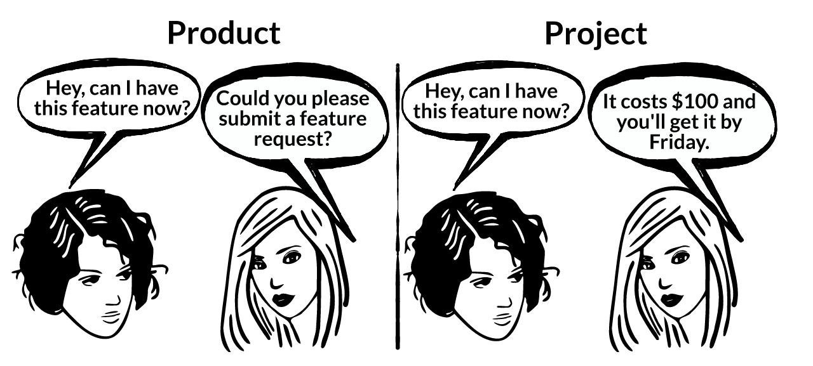

## Introduction

They called me a project manager more than twice. I wasn’t shocked. The other day, a colleague sent me a message “I am doing a master’s! Next week I am going to learn your stuff, project management” damn! Also, the teacher of a technical course for product managers I am doing brought up the subject once again. Olah lah! Today I am sure there is a clear need to prioritize this old post I started when I tried to define the main differences between products and projects.

## An example

Let’s consider WIX. They are building a tool that allows their customers to create web and mobile sites through an online drag-and-drop interface. In contrast, let's consider a company building custom sites or apps for its customers, usually called a software development agency or house. They are moderately different, aren't they? They both target those who need a website. However, in the case of WIX, the customer buys a subscription, logs in to the WIX portal, and can build their pixel-ready website themselves. Instead, in the agency case, a customer negotiates several parts of the website, the price, and the milestones in advance. The house then delivers the pixel-ready website.

 

> WIX builds a **readily consumable product** while a house builds and maintains **projects to be used** by their customers only.

## The development cycle

**Product development** is usually subject to a repetitive development routine, from ideation to testing and launch. It outputs increments and adds on existing working software, adding new releases while continuously integrating new product functionality and fixes fed by various customer and non-customer requests. On the other hand, **project development** is usually pre-planned on static requests and milestones as part of a negotiated contract. You might see many more unsupported projects than products out there, mainly because support is usually part of a different negotiation. It's an add-on.

## The sketch

## Product

An alive piece of software that is the output of a repetitive development routine. It changes fast, adding functionality and fixing production failures in hours (or days) while users own or rent it.

* Value discovered and integrated continuously
* Requirements come from product research
* Launch relates to the product development lifecycle
* Customers pay for what they see
* And what they see is what they get
* Available development time renews
* Products are born to scale

 

> They follow a routine production process before being published and updating themselves on the fly.

## Project

A set of tasks that a company or team must complete to arrive at a particular output. This output is part of a stakeholder request. In most cases, the stakeholder is the customer or one that represents them.

* Value is defined by the customer
* Requirements are set at the agreement
* Launch relates to predefined milestones
* Customers pay for what they agree (Hopefully, they will get it as well)
* After they see a proposal
* Available development time is finite
* Projects are born for dedicated use

 

> They follow a custom development process before being published and updating themselves on customer requests.

## Vision

An organization's vision statement is an aspirational declaration that outlines its long-term goals. A successful vision statement inspires and steers the organization’s efforts. Let's see an example for each case. A product company's vision might look like the following; **Reinvent how people share knowledge, tell stories, and inspire their audiences to act**. Inspiring! On the other hand, a software house's vision statement might look like this; **We develop custom software that makes a difference**. It looks like a mission rather than a vision, right? If you ask me, a product DNA company follows its vision and the value its core idea delivers to the user community. On the contrary, a project DNA company follows its customers' ideas and their value definition. Okay, they try to sell some more value as well.

## The confusion

Apart from hybrid companies, you notice them while browsing pricing pages and come across plans that say "Contact us", there is a lucid differentiation. They are initially building a product and also offer custom configurations or features on top of their core. Another great confusion happens with early-stage product startups. While crossing their valley of death, they might pursue one-two projects to fix their cashflow issues, but that's all folks. As the product becomes sexier because it serves the modern digital revolution needs, custom application providers try to position their services as products. They sometimes don't even understand the difference, but they try to hire Product Managers. I agree that one can productize parts of their developed projects to an extent, but do they really offer a product? I bet they don't, but they are just trying to sell. Will they live to tell their story? Time will tell.

<a href="https://twitter.com/share?ref_src=twsrc%5Etfw" class="twitter-share-button" data-size="large" data-via="ntemposd" data-hashtags="product" data-show-count="false">Tweet</a>

---
Subscribe to my newsletter and get occasional updates.

