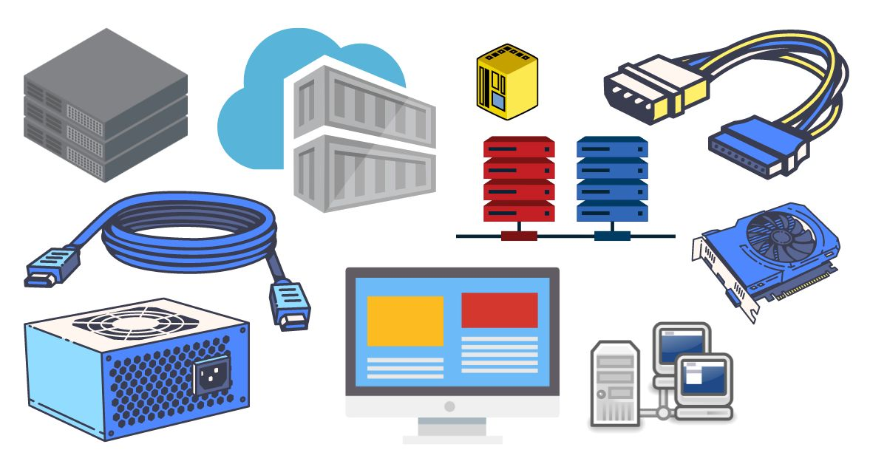

## Introduction

As product management matures you might have noticed the different types of Product Manager roles popping up often. According to a quick search I’ve just performed, there is currently a wide spectrum of Product Manager roles such as Data Product Manager, UX Product Manager, Growth Product Manager, Technical Product Manager, AI Product Manager, Enterprise Product Manager, and the list goes on but this is out of context for now so let’s stop here.

## How much technical

No matter the type of a Product Manager one is, more or less technical, attached to the engineering team or the data scientists or far away in their office doing product research and managing business stakeholders; all Product Managers need to be technically literate. Fullstop. Not technical, just technically literate. Meaning they don’t need to write technical specifications or code but they need to understand the process of creating technology products. What’s the struggle, what writing code means, what’s a merge and why sometimes breaks, what an API is, migration, performance, technical debt, environments, and all those technical terms used in the everyday of product development.

## The why

You might wonder, why one needs to be technically literate? I’ve met professionals covering Product Manager roles without knowing what a code editor looks like. That’s okay, the role is comparatively new and still broad. Those non technical people were hired and earned their living from being Product Managers. They were adding value to their organization but wait, were they adding the value that a tech-literate Product Manager could add? Let’s say you are a Product Manager for a B2B company, during a sprint where the goal is “Build the Form API”. Your non-technical Customer Success colleague has their monthly update to your most important customers soon, so they ask you, “What are we currently building?”.

## The customer success case

The short answer is “We are building the Form API”, so your colleague goes to the customers and says “We are building the form API”? That’s tough… the customer is now triggered to ask your colleague what is an API and what about the actual Form that they’ve asked for. How one can interpret this “Building the Form API” into a business digestible language? Does building the API means the customer could use the Form itself by the end of the sprint. Nope, so you’d better be safe than sorry. A technically literate Product Manager would answer "We’ve just created the database to store the Form responses and now working on submitting the user-generated data into the database. Next up, we’ll start working on the look and feel which is the same as any other Form of our App. We'll probably have the feature ready by the end of the next sprint".

## The development team case

Another common anti-pattern is the Product Manager keeping notes on the engineers' estimates and coming back to say “Why this Form will take 21 points? Last time we built a Form it took us 8.”. That’s not a great question to ask the development team... they might respond in short “This time the backend is not in place” but hey, what a technically illiterate person can get from this answer? Trying to interpret their short answer, they might mean "We need to create a new table in our database, the Form’s front-end, and the API to save the Form data into the database, our database is a relational one so the new table creation is a bit complex. On the contrary, last time both the table and the API were ready, the only thing we had to do was adding a Form on our front end". Are you sure it's necessary for your technical lead to always be answering the long way?

## How to become technically literate

Wrapping it up, tech skills are considered hard skills while business soft ones. It seems harder for a business background person to understand tech, while it's easier for a tech background person to own the technical concepts and acquire the business ones. To be honest, coming from a business background I second that. However, if there is a way of becoming technically literate fast and safe that's by doing it. One could argue it depends on your way of learning things, but to kick things off learn a programming language (Maybe Python or even HTML, free courses are everywhere), set up a little product yourself, even a website but no CMSs and stuff, launch 2-3 versions, attend tech meetups, on easy going days ask the engineers, and read. I bet there are more ways though; send me yours on [Twitter](https://twitter.com/ntemposd).

<a href="https://twitter.com/share?ref_src=twsrc%5Etfw" class="twitter-share-button" data-size="large" data-via="ntemposd" data-hashtags="product" data-show-count="false">Tweet</a>

---
Subscribe to my newsletter and get occasional updates.

