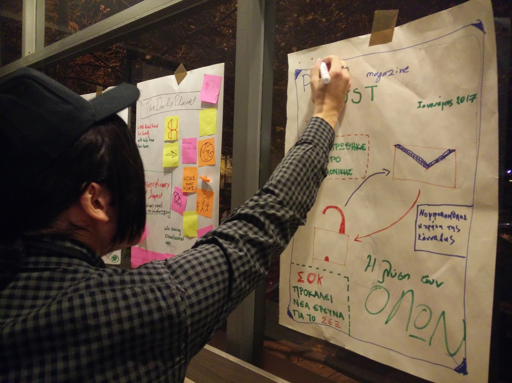
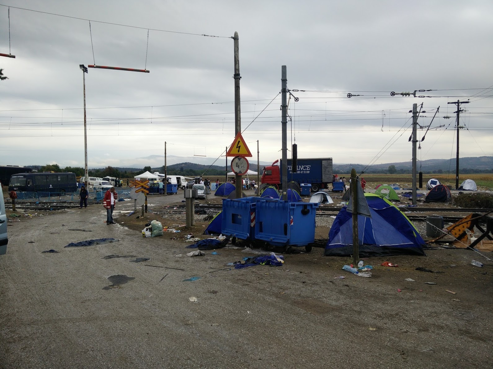
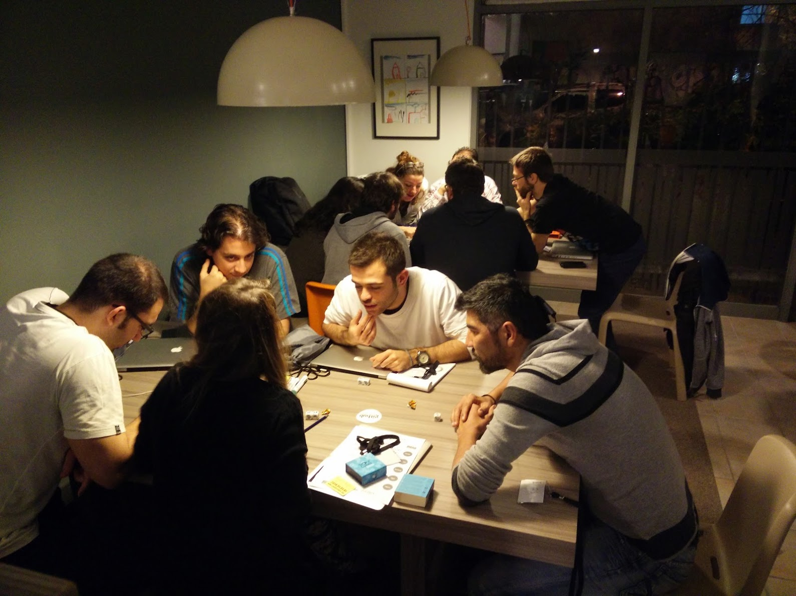
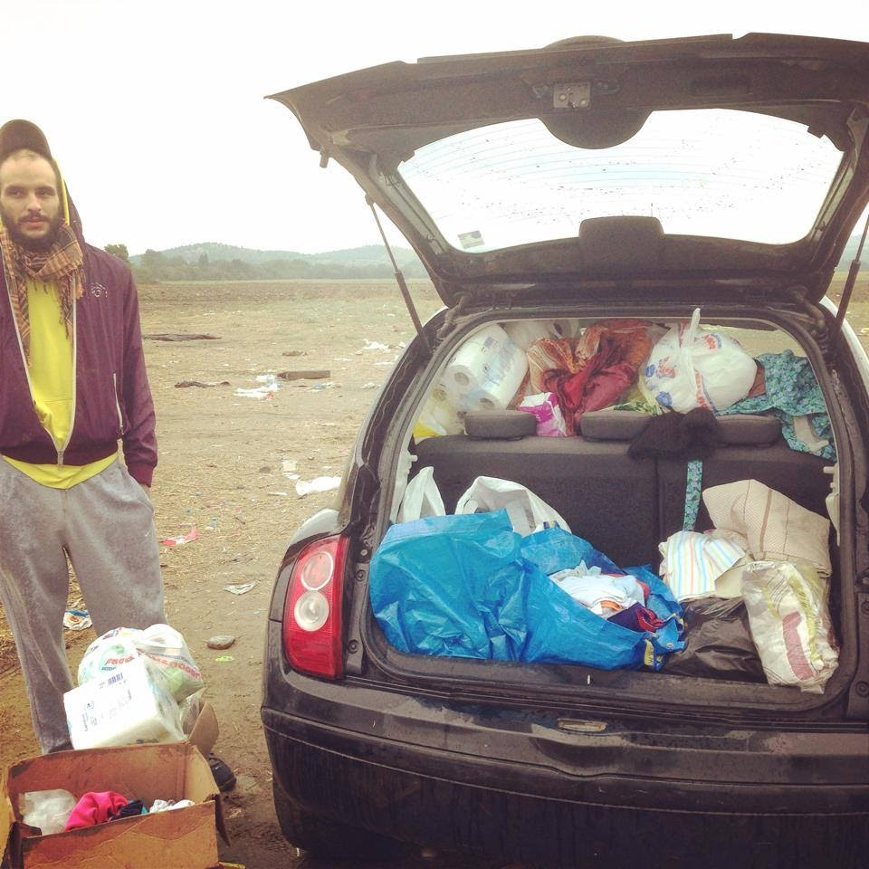

## About BorderHack

In 2015 alone, more than 500,000 refugees and migrants risked their lives crossing the sea to reach Europe. BorderHack is a game-changing hackathon weekend aimed to produce tech solutions to the many challenges that refugees faced along their journeys during the refugee crisis pick of 2015.

## My role at BorderHack

At the core organizers team of BorderHack; tried to connect teams with real refugee and host organization needs.

* Coding the Hackathon's website
* Hackathon Production & Program Management
* Event & Logistics administration

## BorderHack's output
Local techies have created prototypes and ready to use solutions within a weekend.

### Bordershare
An imformation sharing website that aggregates all donation points within a city for goods to be distributed at refugee fields.

### Across
Aims to match people who speak Arabic and Farsi with field volunteers in order to solve language translation and communication issues of refugees.

### Volreach
Volreach is a platform for sourcing demographic data for volunteers making recruiting in times of crisis feasible.


BorderHack's [Code Repository](https://github.com/BorderHACK-org "BorderHack GitHub Organization")


## BorderHack moments

Get the complete BorderHACK album [here](https://www.facebook.com/BorderHACK/photos "BorderHack Photos").

