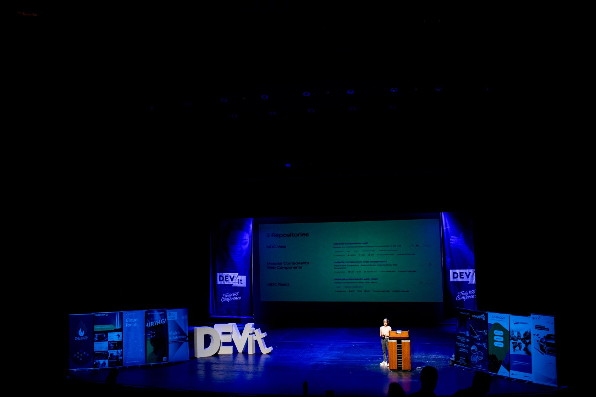
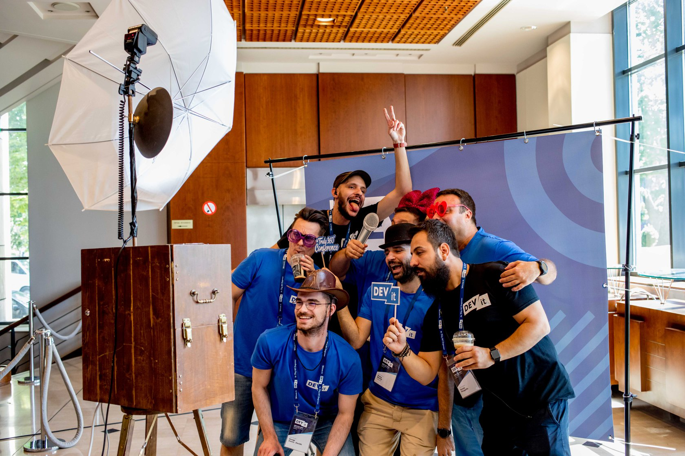
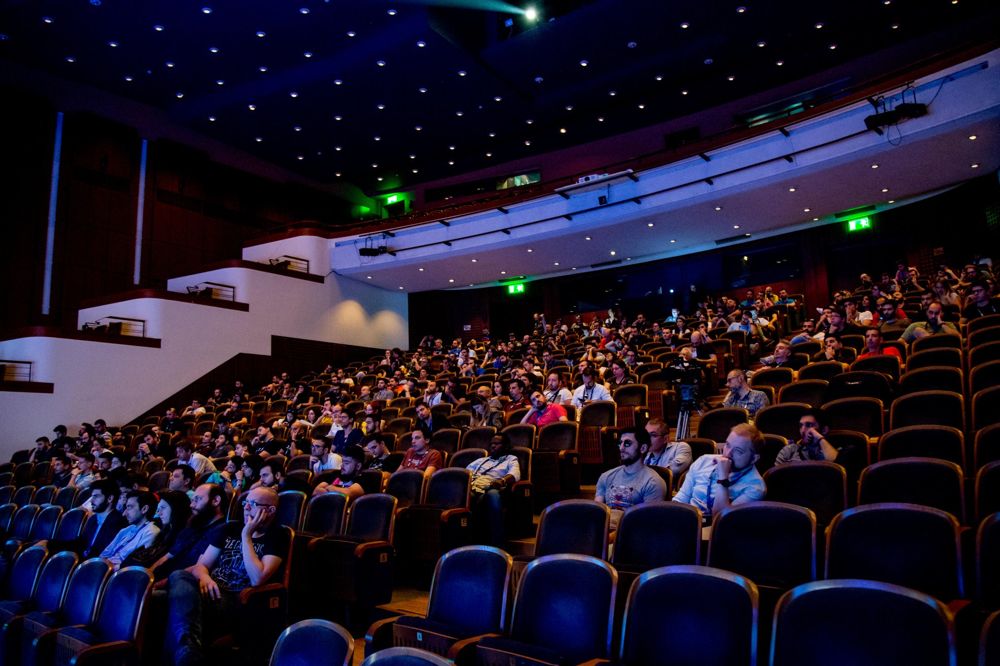
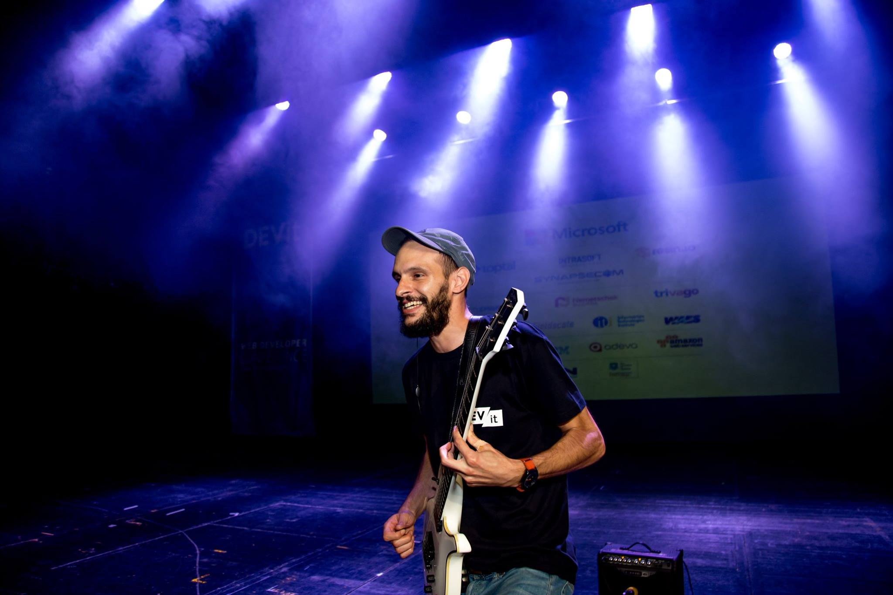

## About DEVit

DEVit has been a community driven Web Development Conference in Thessaloniki, Greece. Started back in 2015 DEVit is known for its top speaking talent, the advanced workshops on all trending web technologies and its diverse mix of attendees. DEVit has been the defacto yearly meeting-point of all seasoned web development professionals in Greece.

## My role at DEVit

DEVit has been organized by a team of 30+ volunteers and powered by SKGTECH NGO, all members were working remotely throughout the year and getting together the days before the event for preparing the ground and drinking :beers:. Being part of such an exceptional 30 people diverse team for 5 consecutive years is a story worth telling to anyone. Apart from being a Board Member at SKGTECH my works at DEVit included

* Project & Marketing Management
* Financial Operations
* Ticketing Administration

## DEVit moments

