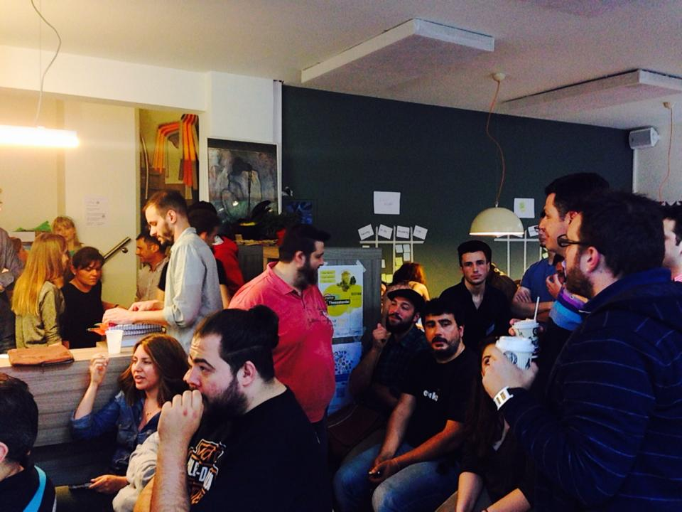
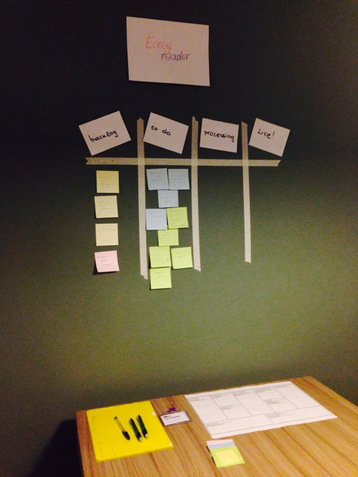
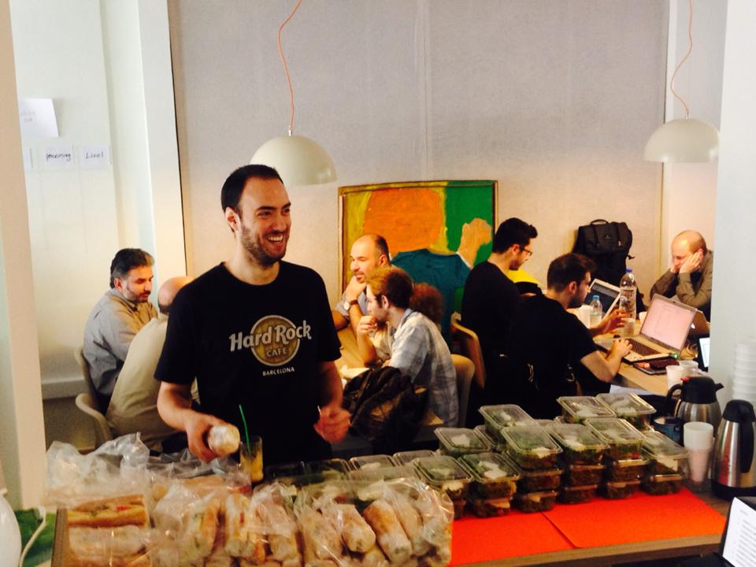

## About Startup Live

Startup Live is the starting point for new aspiring entrepreneurs who seek to boost their business to the next level. During weekend-long events, Startup Live connects you with your local ecosystem and helps you grow your business.

## Startup Live history

Over the years Startup Live has launched more than 70 unique events in 40 cities around the world with over 7.000 participants. The event format is well established and proven in creating many successful start-ups. To throw around big names: Runtastic, Shpock, Qriously, Zoomsquare, Swell, and many more.

## My role at Startup Live

Launched an educational event for early-stage tech startups in close collaboration with Coho, the Startup Live HQs, and local stakeholders. The Community Leader position was held voluntarily and was part of an educational events series powered by Coho back in 2014.

* Event team recruitment
* Educational team recruiting
* Event production
* Project Management

## Startup Live moments

