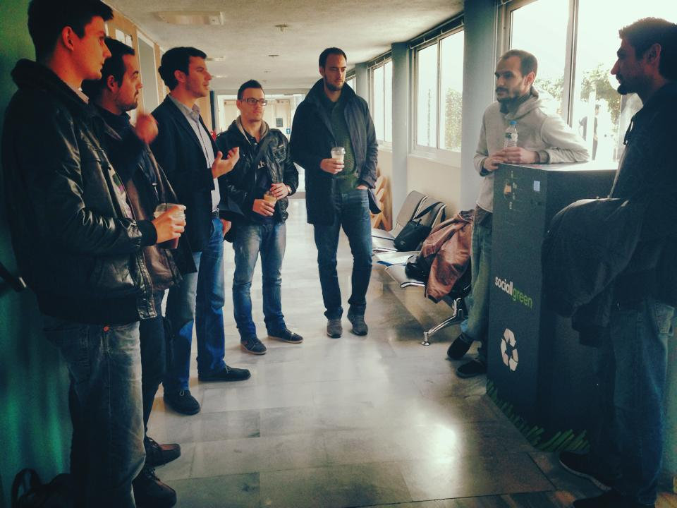
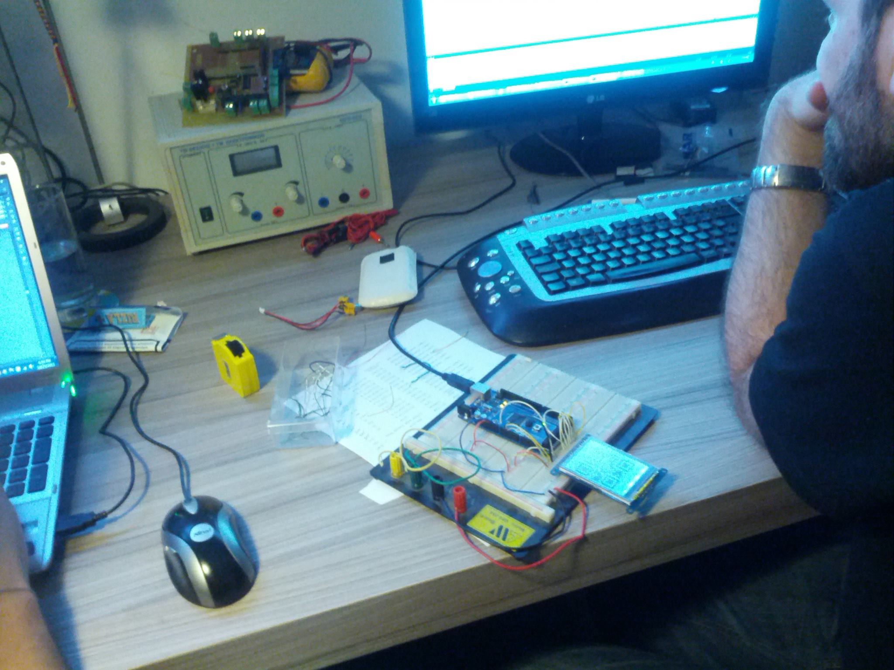
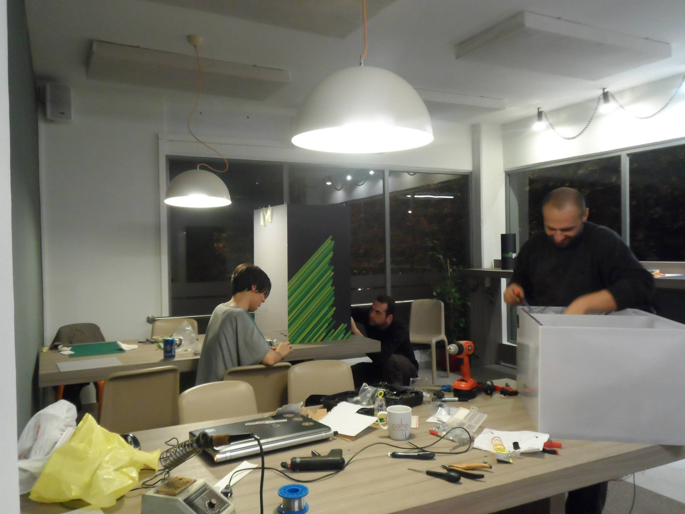
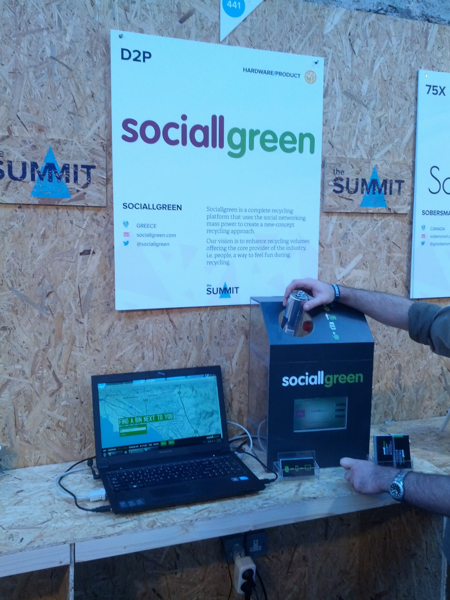
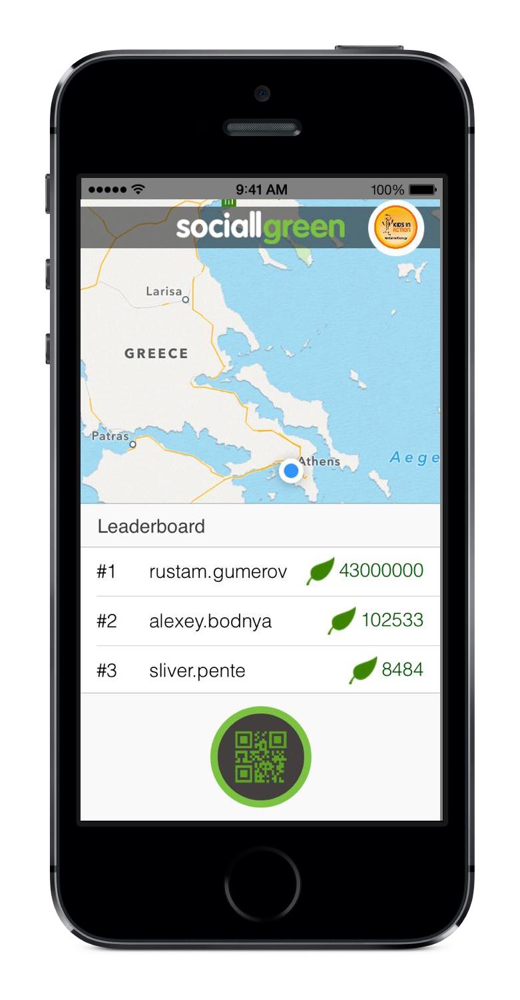

## About Sociallgreen

Sociallgreen adds fun to flat everyday recycling while offering organizations a way to reward green actions. Sociallgreen has been a Green-Tech Startup founded in 2012; they launched a concept new recycling approach for smart cities. Sociallgreen's approach integrates game logic and social network theories to enable a unique physical recycling game.

## My role at Sociallgreen

Role? Is startup founder a role? I have never seen anyone hiring a Startup Founder :sweat_smile:. Being the only business person in a group of young tech professionals has been really fun and creative. From 3 to 8 people and back to 3, I was mainly taking care of

* New Product Development
* Business operations & financial management
* Marketing management & communications
* Fundraising

## Life at Sociallgreen

 Founding a hardware startup to disrupt recycling wasn't what I had in mind when planning my studies. However, it still feels like the best experience I could ever have. From Thessaloniki to Athens and back home, the failure was messy but the whole ordeal was a power boost for what was coming ahead.

 

 

 

 <!---->

## Product Videos


 

