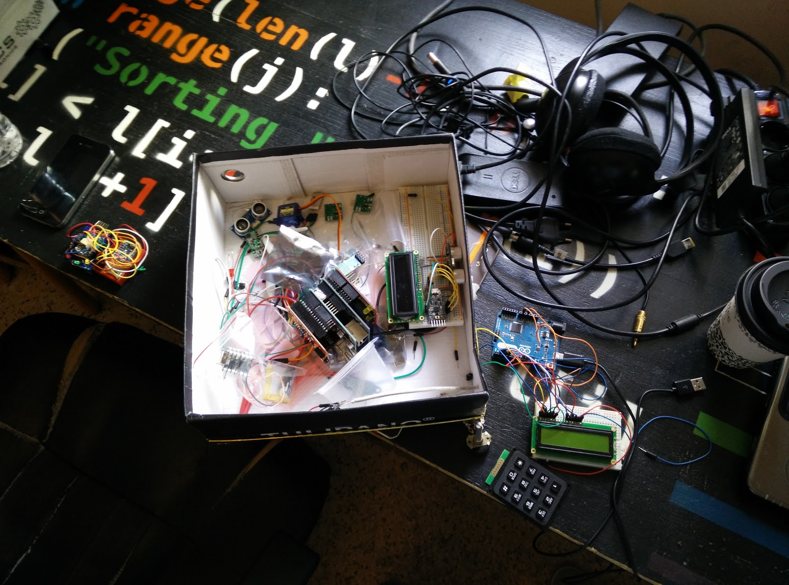
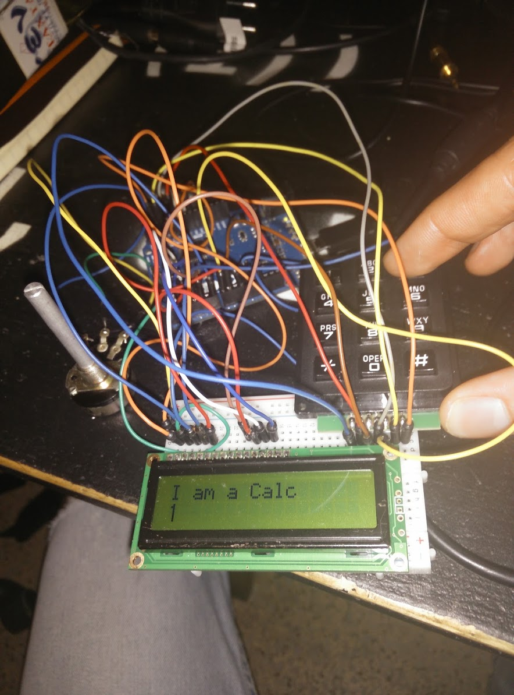

## About Codebender

Codebender is the easiest, most advanced Arduino IDE for hobbyists, educators, and professionals. Write code easily in a great code editor, find bugs faster with the improved error output, and get inspiration by searching in the 350,000+ Arduino sketches on the platform.

## My role at Codebender

Throughout my time at Codebender we have tried to launch a spin-off product for K12 children STEM teachers. Playboard was an educational product for electronics programming, comprised of an Arduino-powered Printed Circuit Board with built-in sensors, a drag and drop Scratch-like user interface, and a series of tinkering tutorials.

* Crowdfunding Financial Analysis and Campaign Preparation
* Customer & User Research (Educator Interviews, K12 Workshops)
* Product Design
* Key Account Management

## Life at Codebender

The friendliest workspace I have ever been in. Back in the days, Codebender's team worked at P-Space, a hackerspace for local geeks, and the place where the idea of Codebender was born. I moved to Patras, Greece to join them and work from the comfort of Codebender's sofa.


