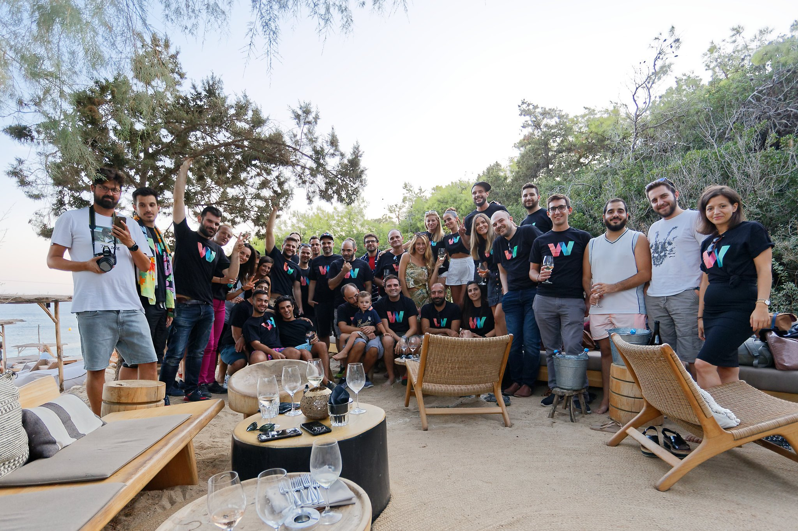

## About wappier

wappier re-invents AI-driven optimization tech for games, apps, economies and markets. By performing tones of ML calculations wappier’s AI engine predicts user journeys in real-time. App publishers maximize engagement and revenue while publishers and marketplaces can leverage wappier’s tech to materially increase their revenues.

## My Role at wappier

Facilitating the production of contemporary entertainment tech solutions for on-chain and off-chain apps.

* Crafting Product Roadmaps
* Creating Features & Business Requirements
* Managing Documentation Projects

## Life at wappier

This has been a Remote role from day one. With the whole team being traditionally at the office, I have been the first remote team member. Well, not for long! The most exciting story to unfold here, is how a fast-growing organization transitioned from Office to Remote in a week or two. One thing I am definitely still missing is traveling to attend team gatherings in Athens, Greece. I sadly couldn't manage to do that post-Pandemic.
