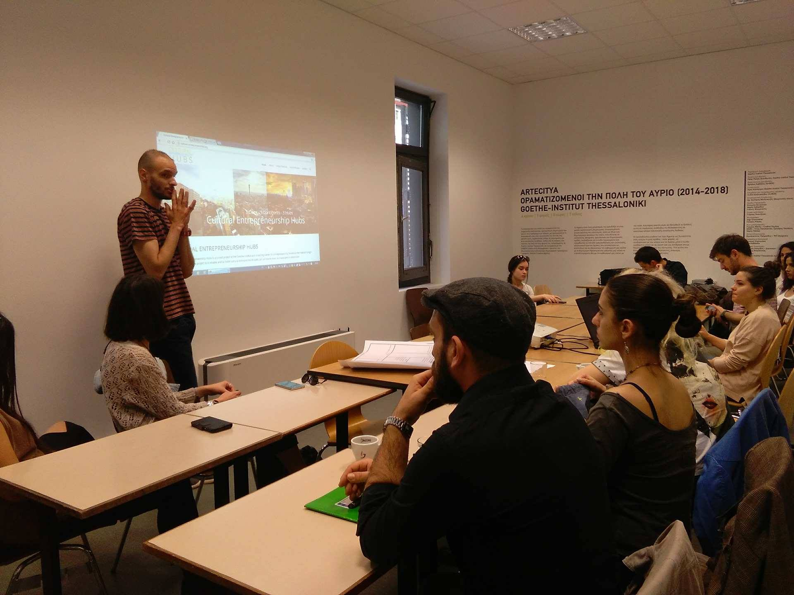
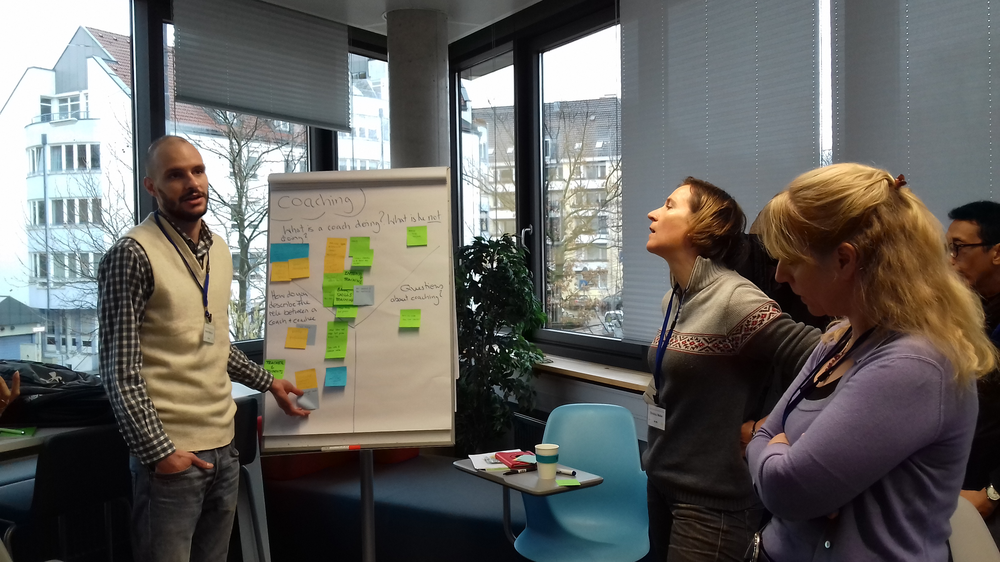
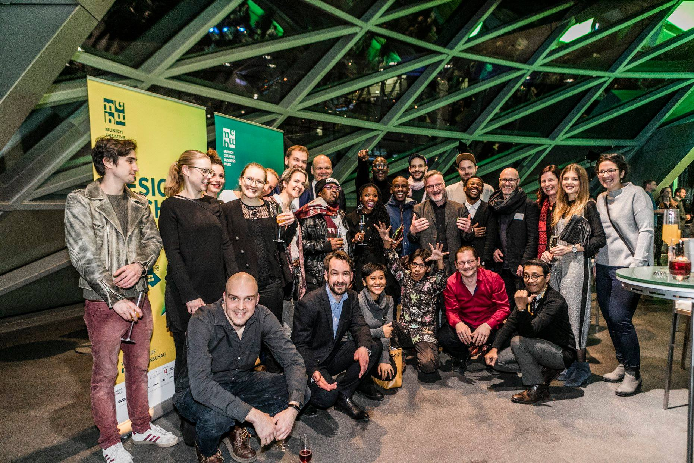
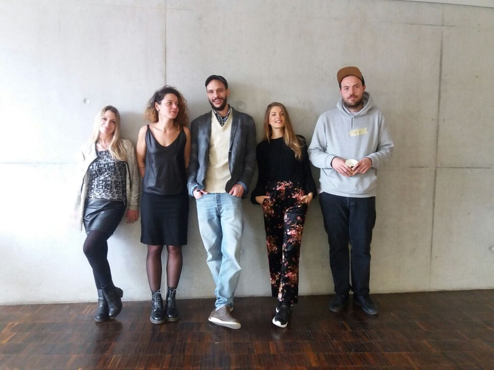
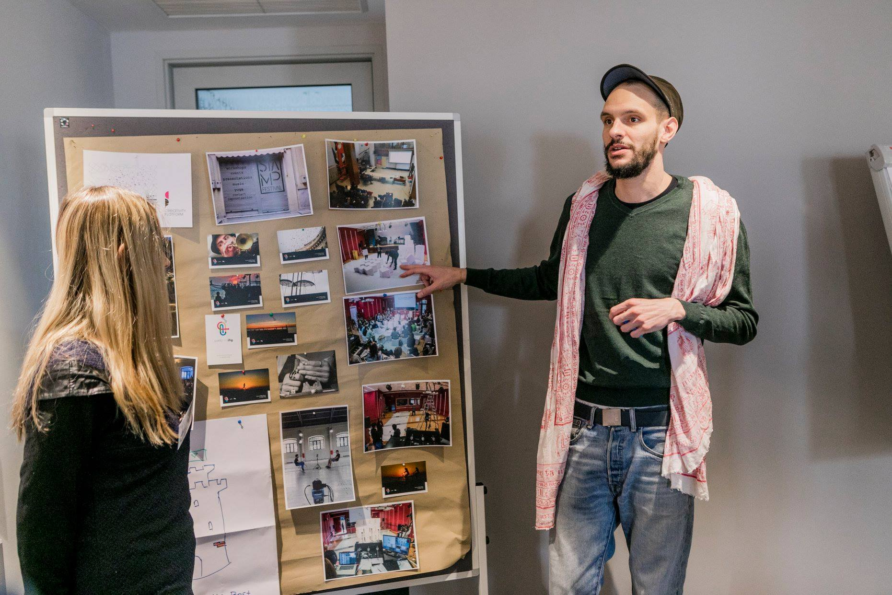

## About the Hubs

The Cultural Entrepreneurship Hubs of the Goethe-Institut has been a project aimed to create centers for creative activities in South Africa, Indonesia, and Greece. There Startup consultants trained by the Goethe-Institut and the Strascheg Center for Entrepreneurship advise teams from the cultural and creative industries and work with them on their respective Startup ideas.

## My role at the Hubs

Working with Goethe-Institut Thessaloniki to build a local hub for artists by curating educational workshops for local creatives. Workshops main theme was how to transform their crafts into a real business.

* Educational content preparation
* Workshop planning & instruction
* Business coaching

## Hubs moments

<!---->


