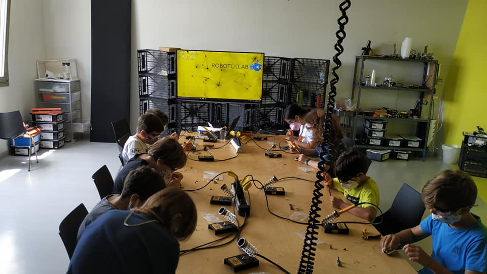
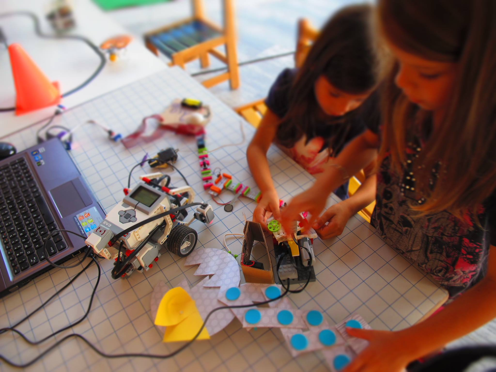

## About Robotixlab

Robotixlab turns education into an unforgettable experience by creating concepts based on learning by doing, theme based scenarios, embracing failure and promoting iterative design cycles. Robotics engineers, creative educationalists and artists work together to bring to life tailor-made activities and custom made hardware.

## My work at Robotixlab

 I met with Robotixlab people during building Playboard. Some months later I was proposing improvements to their financial operations model on the road to accommodate new initiatives for potential revenue streams, mainly Crowdfunding.  

* Business Model Evaluation
* Financial Operations Consulting
* Crowdfunding Campaigns Analysis

