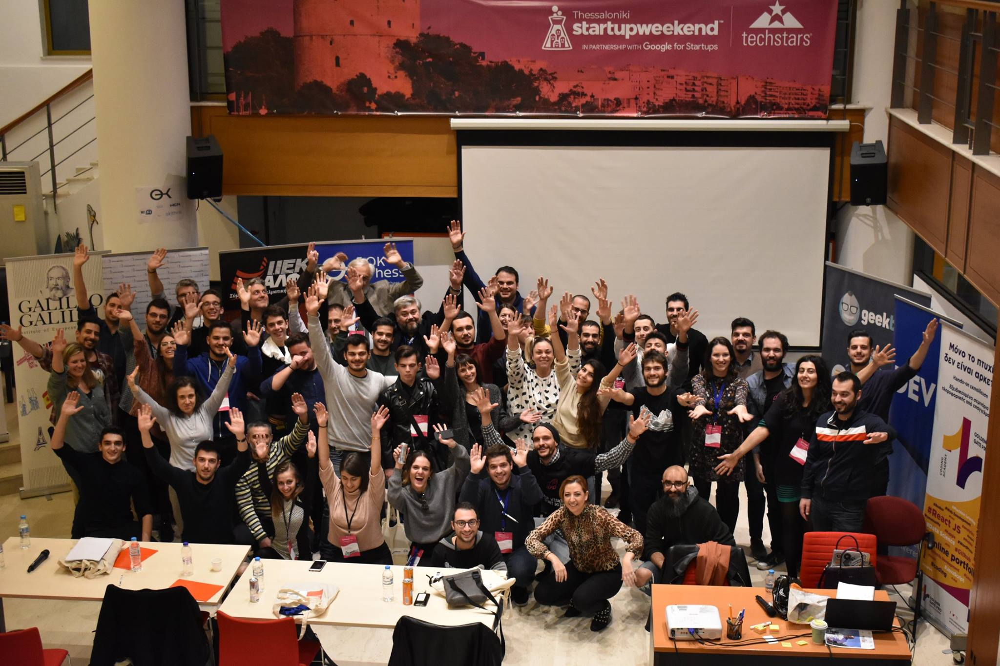
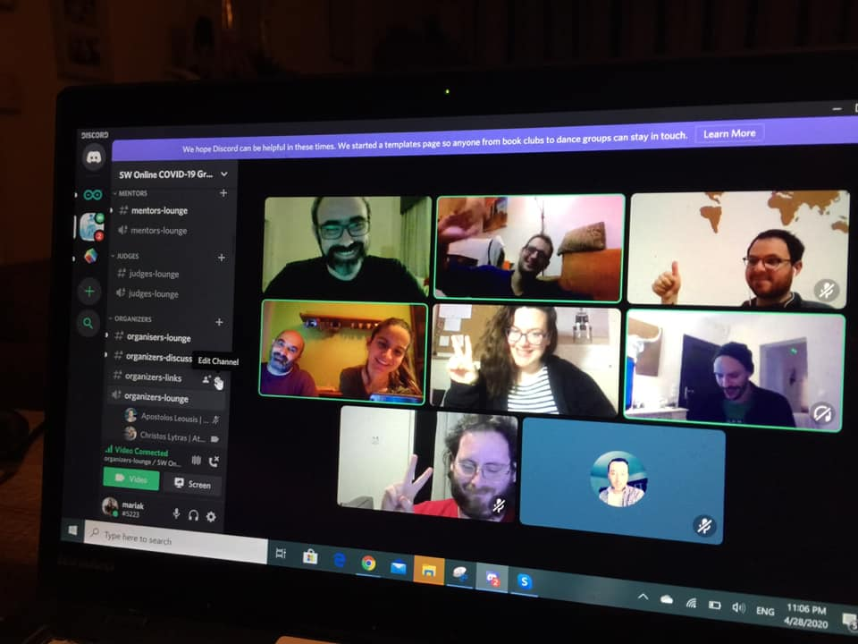
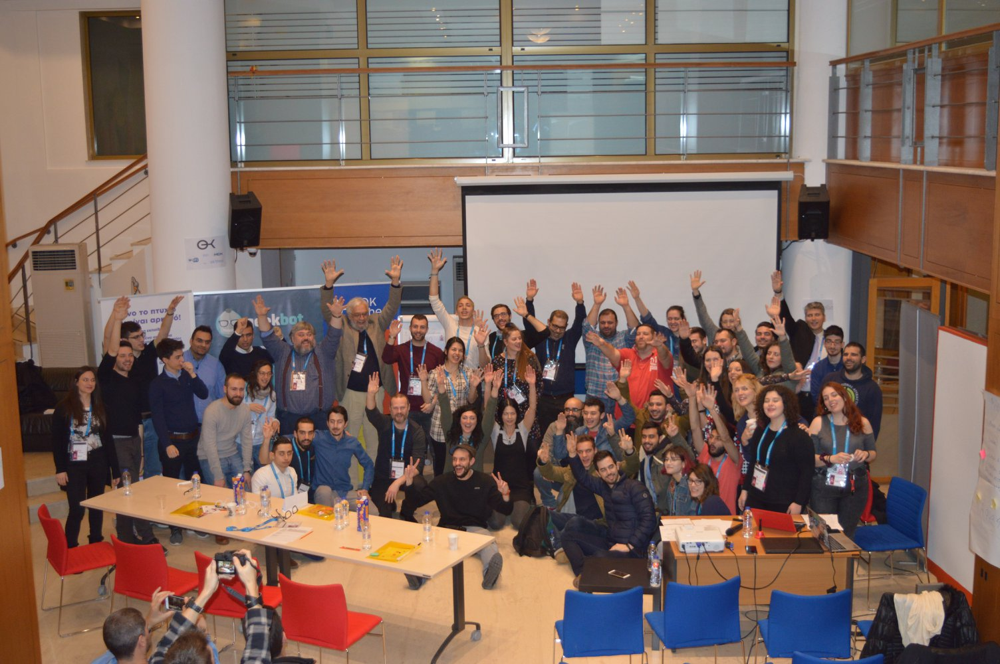
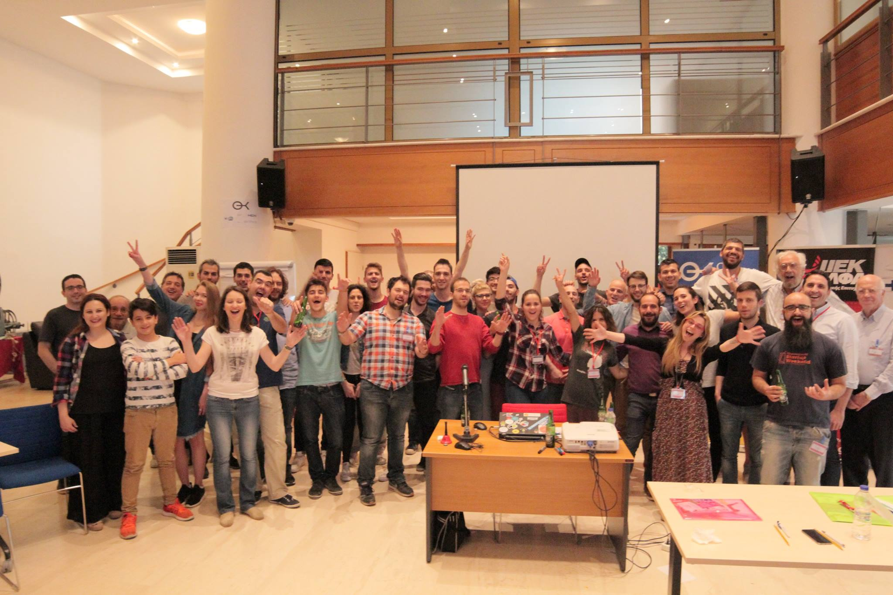

## About Startup Weekend

A Techstars Startup Weekend (also known as StartupWeekend or SW) is a 54-hour entrepreneurship educational competitive event in which participants form teams around ideas on Friday evening and work during the weekend to develop a working prototype demo, and VC presentation by Sunday evening.

## Startup Weekend history

Startup Weekend is a hackathon-like event started back in 2007 in Boulder, Colorado, USA. As of December 2016, it has reached 135 countries, involving over 210,000 entrepreneurs. Upon its 2015 acquisition from Techstars, Startup Weekend, alongside Startup Week and StartupDigest, became part of the Techstars family of startup programs.

## My role at Startup Weekend

Running Techstars educational programs for the local tech community in collaboration with several stakeholders and the Techstars Europe HQs. The local Community Leader position is held voluntarily and was initially an addon to the Community Management role at OK!Thess.

* Event team recruitment
* Educational team recruiting
* Project Management
* Mentoring

## Startup Weekend Moments

