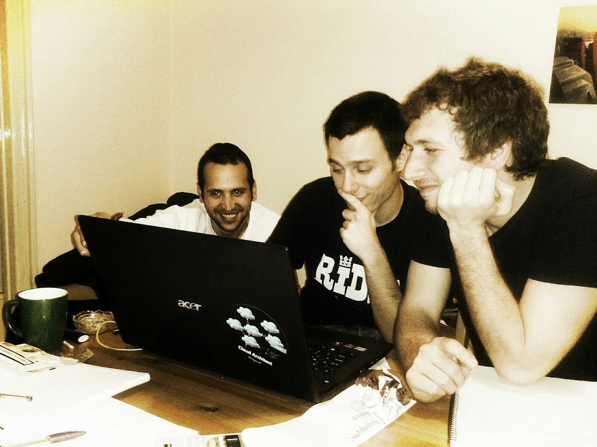
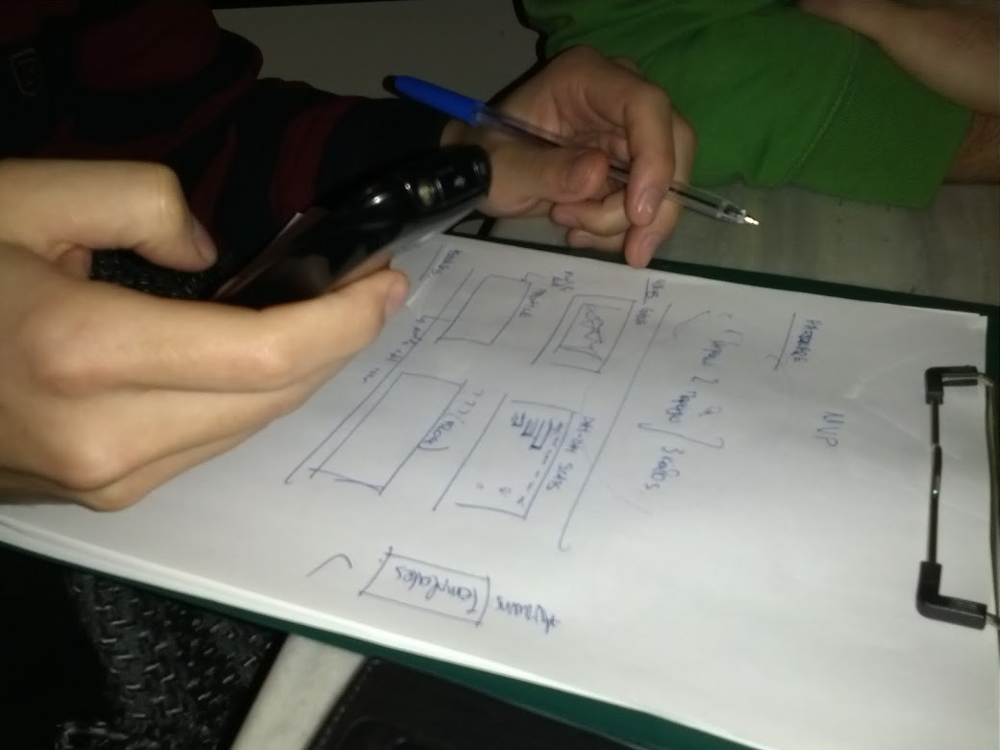

## About Kiwe

An infant crossfunctional tech team of the early 10s. Kiwe's goal has been to provide customers with applications matching their needs. During the early days of App development, Kiwe employed fresh academic knowledge combined with quality market research to launch many interesting projects.

## My role at Kiwe

Being the only business student in a group of tech students with zero tech industry experience has been illuminating for what's coming. Kiwe was the first touchpoint with tech colleagues and the first step into the tech industry. My work was mainly on

* Business Plan Preparation
* Customer Research
* Marketing Management

## Life at Kiwe

Early years with lots of brainstorming:bulb:, beers:beers:, and rapid implementations:iphone:. Sitting all together around one:one: screen for hours, doing things like parsing the 2012 London Olympics website schedule to create an Android App :sweat_smile: and much more.

## Kiwe projects

Here are some of our projects.


 

 

 

