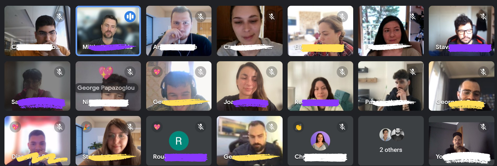

## About 100mentors

At 100mentors, I had the opportunity to be part of a company dedicated to democratizing education for all. 100mentors provides customers with the means to upskill their workforce and, lately, offers training in the skill of the upcoming decade: mastering the art of asking better questions.

## My role at 100mentors

As the company's initial dedicated product hire, I navigated a transitional phase during my time at 100mentors. Following the LLM commercialization with ChatGPT and related projects, the company sought to integrate AI into their product. In addition to managing aspects of the traditional upskilling app, I collaborated with a highly skilled Product Designer and the CTO to pave the way for this transition.

* New Product Development
* Requirements Analysis
* Product Design
* Roadmapping

## Life at 100mentors

I was fortunate to join a team that prioritizes active listening, intellectual humility, respect, and work-life balance. Throughout my six months with the team, I always felt included, even during my parental leave month. The company's values align perfectly with my own, and I wholeheartedly recommend it.
