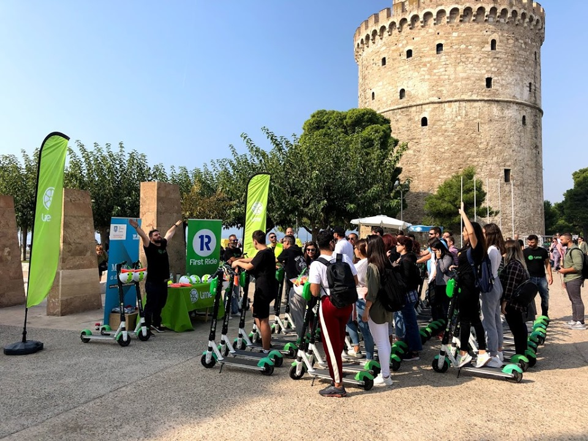
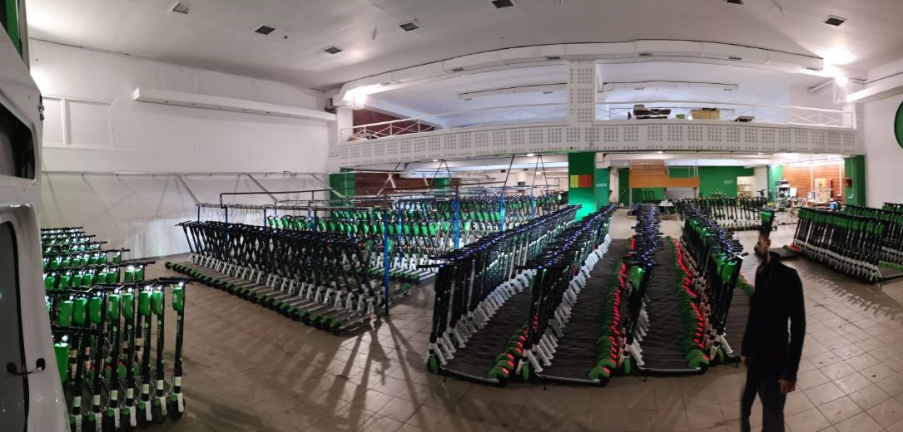
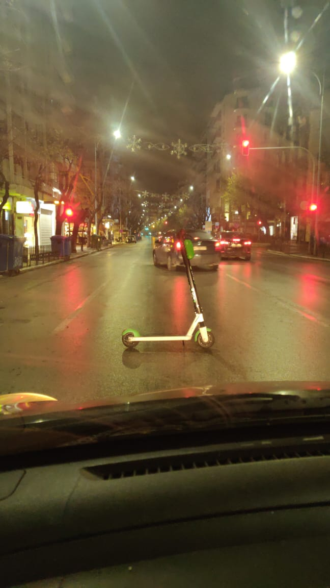

## About Lime

Located in more than 100 cities worldwide, Lime provides a modern mode of transportation for our changed world. Lime is founded on a simple idea that all communities deserve access to smart, affordable mobility. Through the equitable distribution of shared scooters, bikes and transit vehicles, Lime aims to reduce dependence on personal automobiles for short distance transportation and leave future generations with a cleaner, healthier planet.

## My role at Lime

When Lime launched in Thessaloniki back in 2019, an opportunity to cross paths with a global tech unicorn and observe operations from the inside was just around the corner. I felt super curious and somehow managed to land a short-term Lime worker position for mainly hunting scooters with a Mini-Van around the city.

* Hunting scooters around the city
* Scooters quality assurance
* Deploying scooters at the deployment points
* On-the-Spot supporting scooter riders with the app

## Life at Lime

Lime's scooter warehouse, strategically positioned in the city center, was not only the workplace of ~20 drivers and hardware engineers but also an ideal place for huddling with colleagues before and after shifts. The highlight of this position. Apart from getting free unlimited scooter rides, I enjoyed meeting all of Thessaloniki's neighborhoods.

