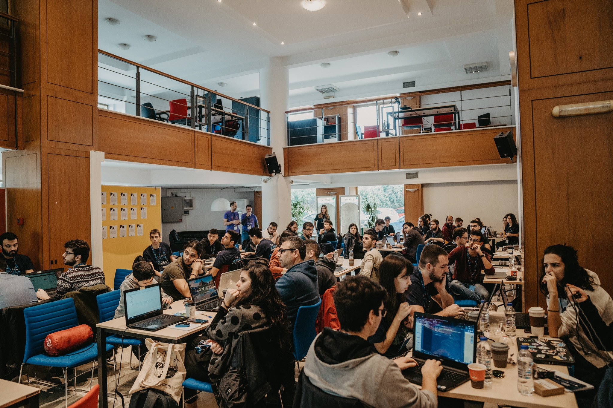
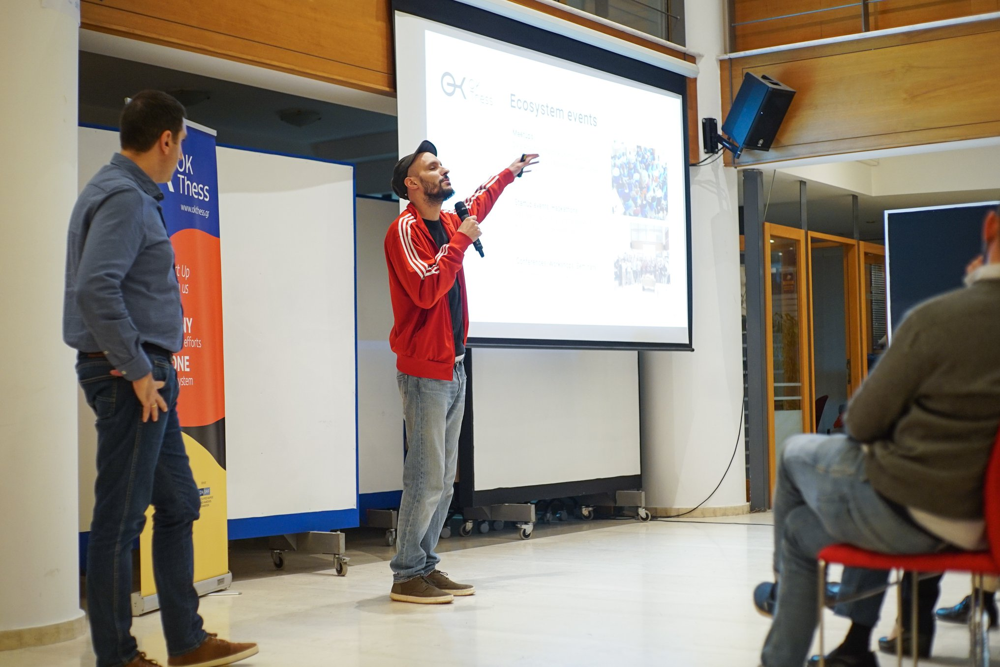
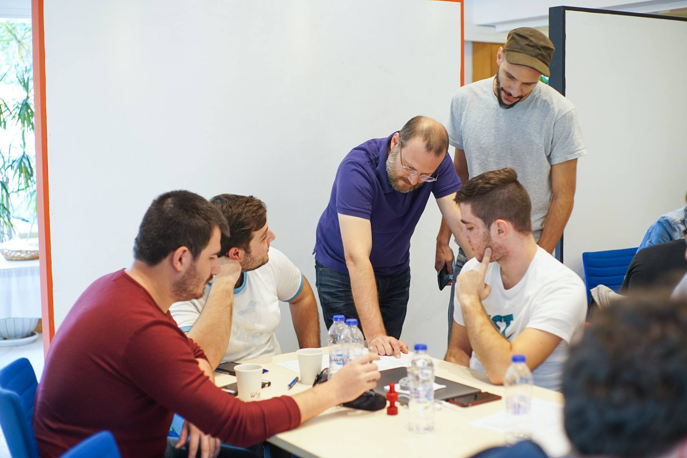

## About OK!Thess

The City of Thessaloniki incubator for tech startups; backed by a consortium of ten local organizations made up of universities, associations, and governmental bodies. OK!Thess has been a cornerstone contributor to the growth of Thessaloniki's innovation ecosystem. It offers an acceleration program for entrepreneurs and a community space for meetups and open events where like-minded peers mix and connect.

## My role at OK!Thess

The first contractor in a team of four eventually turned into a full-time employee. Throughout my time at OK!Thess I have been managing major parts of the project from scratch to 45 graduated startups & 200+ events/meetups.

* End-to-end Project Management
* Hosted Startups Coaching
* Event Planning and Execution
* Marketing & Community Management
* Website and Automation Tools Development

## Life at OK!Thess

Five, on foot, minutes from Thessaloniki's Seafront and three from home with an open space of 1000 square meters sounds like a nice place to work, I confirm it is! If I had to select a moment, I am still between working while an event of 150 people is running or enjoying a relaxed morning between young tech startup geeks.

