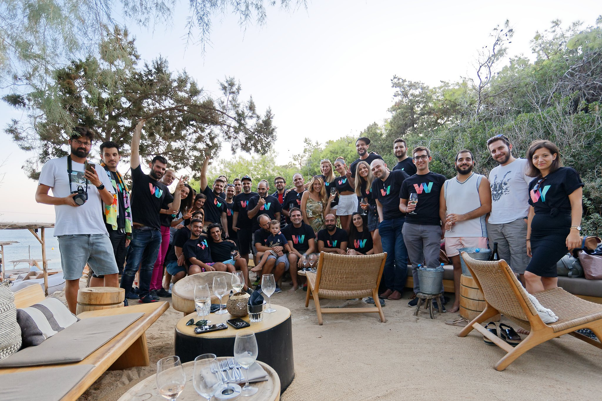

## About wappier

wappier re-invents AI-driven optimization tech for games, apps, economies and markets. By performing tones of ML calculations wappier’s AI engine predicts user journeys in real-time. App publishers maximize engagement and revenue while publishers and marketplaces can leverage wappier’s tech to materially increase their revenues.

## My role at wappier

I was the first product hire at wappier where I facilitated the production of contemporary entertainment technology for the mobile gaming industry. During my tenure, I launched the Αlpha version of a 3D Visualization product, launched an SDK-powered Next Best Action framework and extended its use by launching a Next Best Action Shopify application for merchants. I also closely advised C-level colleagues on best practices and recommended a Product Management framework for the company. Finally, I played a key role in the early stages of the company-wide documentation project.

* Managed Product Roadmaps
* Created Features & Business Requirements
* Led Documentation Projects

## Life at wappier

This has been a remote role from day one. With the whole team being traditionally at the office, I have been the first remote team member. Well, not for long! The most exciting story to unfold here, is how a fast-growing organization transitioned from office to remote in a week or two. One thing I am definitely still missing is traveling to attend wappier's team gatherings in Athens, Greece.
